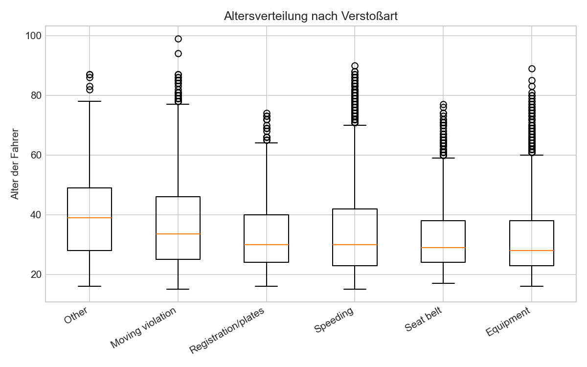

# Police Stop Analysis

Explorative Analyse eines US-amerikanischen Polizeikontrollen-Datensatzes mit pandas
und scipy. Untersucht Zusammenhänge zwischen Fahrer-Merkmalen (Geschlecht, Alter,
Hautfarbe), Verstoßart und Kontrollausgang mit Chi-Quadrat-, Kruskal-Wallis- und
Effektstärke-Tests (Cramérs V).



## Datenquelle

Der Datensatz `police.csv` stammt von Kaggle:
[https://www.kaggle.com/datasets/melihkanbay/police](https://www.kaggle.com/datasets/melihkanbay/police)

Lizenzbedingungen bitte direkt auf der Kaggle-Seite prüfen, hier nicht verbindlich
wiedergegeben, da nicht zweifelsfrei einsehbar.

## Wichtige methodische Einschränkung

Der Datensatz enthält ausschließlich Personen, die bereits kontrolliert wurden. Es
gibt keine Vergleichsgruppe von Fahrern, die nicht angehalten wurden oder nicht
verstoßen haben. Aussagen über die *Wahrscheinlichkeit*, kontrolliert oder eines
Verstoßes bezichtigt zu werden (z. B. nach Geschlecht oder Hautfarbe), lassen sich
mit diesen Daten allein **nicht** treffen, dafür fehlt eine externe Baseline (z. B.
Verkehrszählung oder Führerscheindaten der Gesamtbevölkerung). Testbar sind nur
Unterschiede *innerhalb* der bereits kontrollierten Personen (z. B. Durchsuchungs-
oder Verhaftungsquote je Gruppe).

## Wichtigste Erkenntnisse

- **Geschlecht und Durchsuchung**: Männer werden gut doppelt so oft durchsucht wie
  Frauen (4,33 % vs. 2,00 %), signifikant bei p ≈ 2,5 × 10⁻⁵⁸. Der Unterschied bleibt
  innerhalb fast jeder Verstoßkategorie bestehen, einzige Ausnahme ist "Other".
- **Alter und Verstoßart**: Fahrer bei "Other"-Verstößen sind im Median am ältesten
  (39 Jahre), bei Equipment und Seat belt am jüngsten (28/29 Jahre). Kruskal-Wallis
  statt ANOVA, weil die Altersverteilung rechtsschief ist (Schiefe 0,84).
- **Hautfarbe und Verstoßart**: hängen zusammen, aber schwach (Cramérs V = 0,117).
  Speeding macht bei Asian- (67,5 %) und White-Fahrern (62,2 %) den Großteil aller
  Verstöße aus, bei Hispanic-Fahrern nur 32,5 %.
- **Drogenbezug**: entgegen der Vermutung sind Speeding-Kontrollen am seltensten
  drogenbezogen (0,49 %), nicht am häufigsten — am häufigsten bei Equipment (1,96 %).
- **Tageszeit**: Speeding-Anteil schwankt zwischen 50,6 % (Nachmittag) und 60,4 %
  (Morgen).
- **Durchgängiges Muster**: Bei rund 86.000 Fällen wird fast jeder Zusammenhang
  statistisch signifikant. Cramérs V zeigt, dass die Effekte bei Hautfarbe, Drogenbezug
  und Tageszeit trotzdem durchweg schwach sind (0,05 bis 0,12) — der p-Wert allein hätte
  ein falsches Bild von der Größe der Effekte gegeben.

## Setup

```bash
python3 -m venv .venv
source .venv/bin/activate
pip install -r requirements.txt
python3 police_stop_analysis.py
```

Das Skript schreibt drei Diagramme nach `assets/` (Alter nach Verstoßart, Speeding-Anteil
nach Hautfarbe, Speeding-Anteil nach Tageszeit).

## Status der Fragestellungen

- [x] a) Zusammenhang Geschlecht und Durchsuchungswahrscheinlichkeit: signifikant,
      Männer werden gut doppelt so oft durchsucht wie Frauen (4,33 % vs. 2,00 %)
- [x] a.i) Bleibt der Zusammenhang innerhalb der Verstoßkategorien bestehen? Ja,
      außer bei der Kategorie "Other"
- [x] b) Alter vs. Verstoßart: signifikant (Kruskal-Wallis), am ältesten bei "Other"
- [x] c) Hautfarbe vs. Verstoßart: signifikant, aber schwacher Effekt (Cramérs V 0,117)
- [x] d) Drogenbezogene Kontrolle vs. Verstoßart: signifikant, sehr schwacher Effekt
      (Cramérs V 0,060)
- [x] e) Drogenbezogene Kontrolle vs. Geschwindigkeitsverstoß: Speeding seltener
      drogenbezogen, nicht häufiger (0,49 % vs. 1,53 %)
- [x] f) Tageszeit vs. Geschwindigkeitsverstoß: signifikant, schwacher Effekt
      (Cramérs V 0,079)
- [x] Visualisierung der Ergebnisse

Details und Zwischenbefunde stehen als Kommentare direkt im Skript
(`police_stop_analysis.py`, Schritt 4 bis 7).

## Was ich gelernt habe

Die Testwahl hängt vom Skalenniveau ab, nicht davon, was gerade griffbereit ist 
bei b) hätte eine ANOVA nahegelegen, aber ein Schiefe-Test hat gezeigt, dass die
Normalverteilungsannahme nicht hält, Kruskal-Wallis war die richtige Wahl. Die
größere Lektion war aber, den p-Wert nicht mit der Effektgröße zu verwechseln: bei
knapp 86.000 Fällen wird praktisch jeder Zusammenhang signifikant, erst Cramérs V
zeigt, ob davon inhaltlich etwas übrig bleibt. Insgesamt war das Projekt eine gute
Übung darin, die Maße aus den Statistikvorlesungen (Chi-Quadrat, Kruskal-Wallis,
Effektstärken) nicht nur zu kennen, sondern an einem echten, unordentlichen Datensatz
in pandas anzuwenden und auch mal einen falschen Reflex (Chi-Quadrat für eine Frage
mit kontinuierlicher Zielgröße) selbst zu korrigieren.
